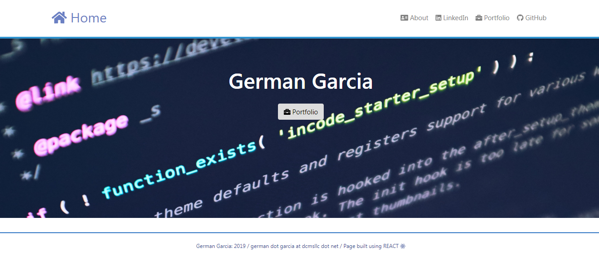
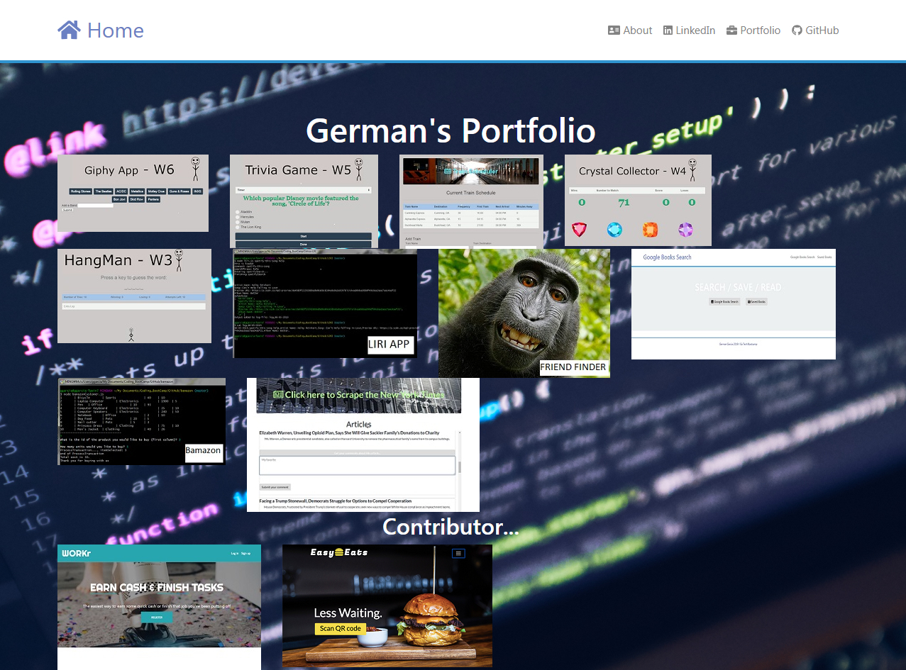

# Personal Portfolio Page
 

Welcome to my `Portfolio Page`. I decided to develop it as a REACT-based application. 

## How it works

1. User comes to `landing page` where there is one option right in the middle to visit the `Portfolio Page`
2. In the top right corner there is a Menu where you can visit my `linkedIn`, `GitHub`, and the `Portfolio page`
3. At the `Portfolio Page` you can click on some of the projects I have developed or where I contributed on:

 

## Application

You can check the deployed version of the application at https://secure-badlands-46200.herokuapp.com/ 